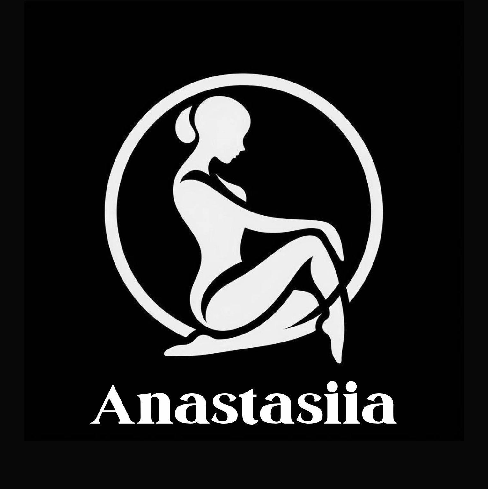

<!DOCTYPE html>
<html lang="en">
<head>
    <meta charset="UTF-8">
    <meta name="viewport" content="width=device-width, initial-scale=1.0">
    <title>Portfolio</title>
    <link href="https://fonts.googleapis.com/css2?family=Prata&display=swap" rel="stylesheet">
    
</head>
<body>
    

        

            
        

        

            <button onclick="document.getElementById('about').scrollIntoView({behavior: 'smooth'})">About Me</button>
            <button>Section 1</button>
            <button>Section 2</button>
            <button>Section 3</button>
            <button>Section 4</button>
        

    

    

    

        <h1>About Me</h1>
        

            

                

                    
                

            

            

                

                    

                        
Hello! My name is Anastasiia Udovenko, and I was born on October 23, 2002, in the charming town of Novomoskovsk, Ukraine. My journey into the world of performance arts began early. At the age of six, I started school, where I quickly discovered a passion for choreography and drawing, attending additional classes to hone my skills.

                        
A year later, my fascination with the circus led me to join the children's circus studio "Melange-art" in Novomoskovsk. This experience was transformative, and in 2016, as part of a talented group of neon jugglers, I had the thrilling opportunity to become a finalist on "Ukraine’s Got Talent. Kids."

                    

                

            

        

    

    <!-- Add more sections for other content if needed -->
</body>
</html>
