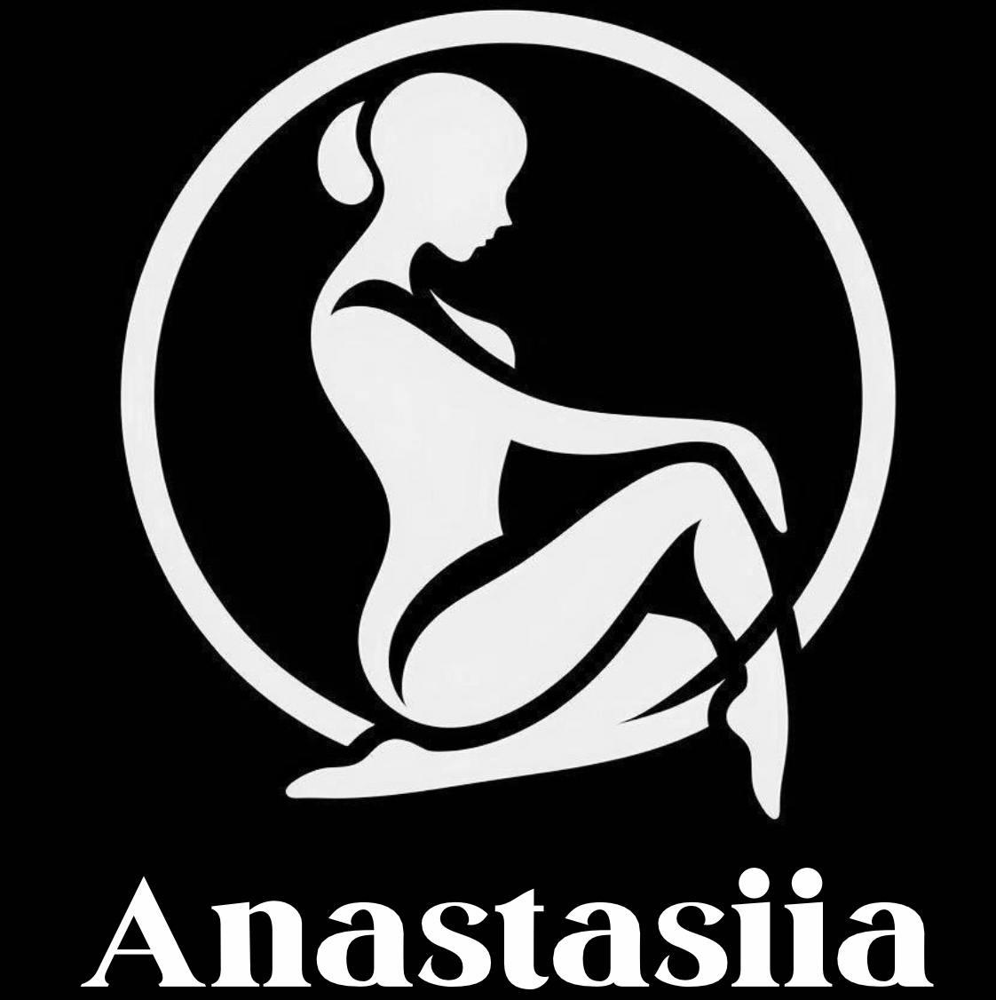
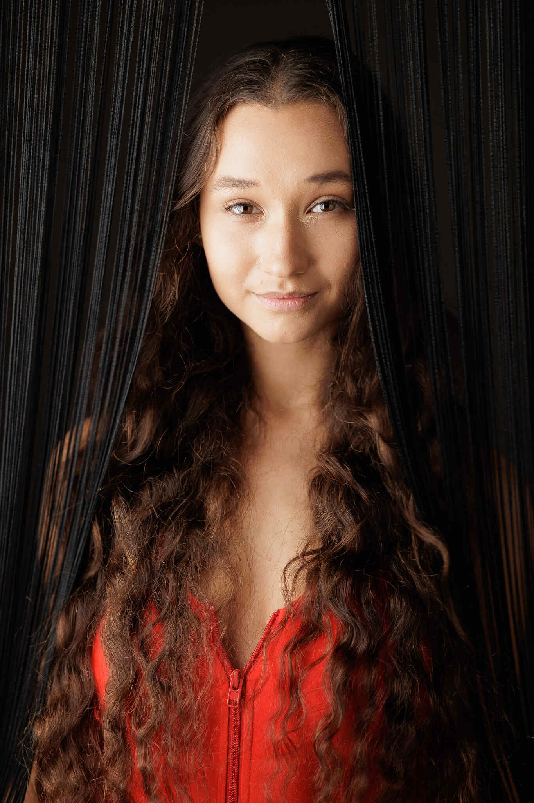
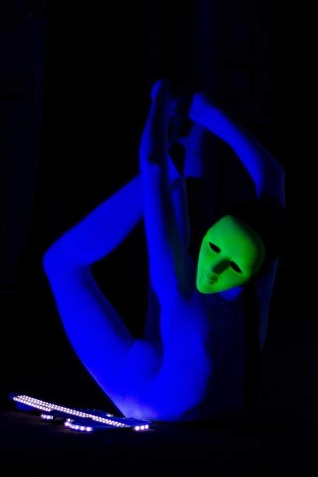
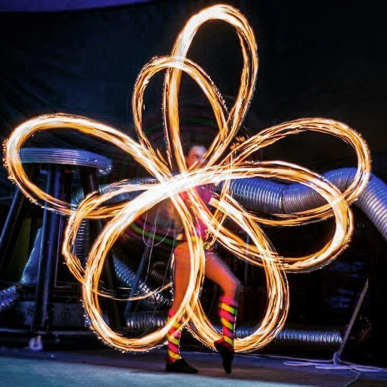

<!DOCTYPE html>
<html lang="en">
<head>
    <meta charset="UTF-8">
    <meta name="viewport" content="width=device-width, initial-scale=1.0">
    <title>Portfolio</title>
    <link href="https://fonts.googleapis.com/css2?family=Prata&display=swap" rel="stylesheet">
    
</head>
<body>
    

        

            
        

        

            <button onclick="document.getElementById('about').scrollIntoView({behavior: 'smooth'})">About Me</button>
            <button onclick="document.getElementById('videos').scrollIntoView({behavior: 'smooth'})">Videos</button>
            <button onclick="document.getElementById('pictures').scrollIntoView({behavior: 'smooth'})">Pictures</button>
            <button onclick="document.getElementById('education').scrollIntoView({behavior: 'smooth'})">Education and Experience</button>
            <button onclick="document.getElementById('about').scrollIntoView({behavior: 'smooth'})">Contact Me</button>
        

    

    

    

        <h1>About Me</h1>
        

            

                

                    
                

            

            

                

                    

                        
Hello! My name is Anastasiia Udovenko, and I was born on October 23, 2002, in the charming town of Novomoskovsk, Ukraine. My journey into the world of performance arts began early. At the age of six, I started school, where I quickly discovered a passion for choreography and drawing, attending additional classes to hone my skills.

                        
A year later, my fascination with the circus led me to join the children's circus studio "Melange-art" in Novomoskovsk. This experience was transformative, and in 2016, as part of a talented group of neon jugglers, I had the thrilling opportunity to become a finalist on "Ukraine’s Got Talent. Kids."

                    

                

            

        

    

    

        <h1 style="text-align: center;">Videos</h1>
    <ul class="video-list">
        <li class="video-item">
            <a class="video-link" href="https://www.youtube.com/embed/pCsbirQaViY">
                <h2>Promo</h2>
                <iframe src="https://www.youtube.com/embed/pCsbirQaViY" frameborder="0" allow="accelerometer; autoplay; clipboard-write; encrypted-media; gyroscope; picture-in-picture" allowfullscreen></iframe>
            </a>
        </li>
        <li class="video-item">
            <a class="video-link" href="https://www.youtube.com/embed/Js4RHO5j7SQ">
                <h2>Hula hoop - Contortion act</h2>
                <iframe src="https://www.youtube.com/embed/Js4RHO5j7SQ" frameborder="0" allow="accelerometer; autoplay; clipboard-write; encrypted-media; gyroscope; picture-in-picture" allowfullscreen></iframe>
            </a>
        </li>
        <li class="video-item">
            <a class="video-link" href="https://www.youtube.com/embed/2j2YWaLqeIo">
                <h2>"Wizards in Winter" ~ Cirque Musica 2023</h2>
                <iframe src="https://www.youtube.com/embed/2j2YWaLqeIo" frameborder="0" allow="accelerometer; autoplay; clipboard-write; encrypted-media; gyroscope; picture-in-picture" allowfullscreen></iframe>
            </a>
        </li>
        <li class="video-item">
            <a class="video-link" href="https://www.youtube.com/embed/D0NNIQ0eBkc">
                <h2>Aerial moon ~ Celebrity Cruises 2021-2023</h2>
                <iframe src="https://www.youtube.com/embed/D0NNIQ0eBkc" frameborder="0" allow="accelerometer; autoplay; clipboard-write; encrypted-media; gyroscope; picture-in-picture" allowfullscreen></iframe>
            </a>
        </li>
        <li class="video-item">
            <a class="video-link" href="https://www.youtube.com/embed/db67Y0X9ZKk">
                <h2>Contortion ~ Celebrity Cruises 2021-2023</h2>
                <iframe src="https://www.youtube.com/embed/db67Y0X9ZKk" frameborder="0" allow="accelerometer; autoplay; clipboard-write; encrypted-media; gyroscope; picture-in-picture" allowfullscreen></iframe>
            </a>
        </li>
        <li class="video-item">
            <a class="video-link" href="https://www.youtube.com/embed/iknI4urKxaY">
                <h2>Aerial Lyra experience</h2>
                <iframe src="https://www.youtube.com/embed/iknI4urKxaY" frameborder="0" allow="accelerometer; autoplay; clipboard-write; encrypted-media; gyroscope; picture-in-picture" allowfullscreen></iframe>
            </a>
        </li>
        <li class="video-item">
            <a class="video-link" href="https://www.youtube.com/embed/P8M5aoNRzi0">
                <h2>Silks experience</h2>
                <iframe src="https://www.youtube.com/embed/P8M5aoNRzi0" frameborder="0" allow="accelerometer; autoplay; clipboard-write; encrypted-media; gyroscope; picture-in-picture" allowfullscreen></iframe>
            </a>
        </li>
        <li class="video-item">
            <a class="video-link" href="https://www.youtube.com/embed/FvP84u08ppQ">
                <iframe src="https://www.youtube.com/embed/FvP84u08ppQ" frameborder="0" allow="accelerometer; autoplay; clipboard-write; encrypted-media; gyroscope; picture-in-picture" allowfullscreen></iframe>
            </a>
        </li>
        <li class="video-item">
            <a class="video-link" href="https://www.youtube.com/embed/KBQjVvvkk0Q">
                <h2>"Bad Girl" hula hoop ~ Celebrity Cruises 2021-2023</h2>
                <iframe src="https://www.youtube.com/embed/KBQjVvvkk0Q" frameborder="0" allow="accelerometer; autoplay; clipboard-write; encrypted-media; gyroscope; picture-in-picture" allowfullscreen></iframe>
            </a>
        </li>
        <li class="video-item">
            <a class="video-link" href="https://www.youtube.com/embed/PM0cf7knRHY">
                <h2>"Champagne Supernova" ~ Celebrity Cruises 2021-2023</h2>
                <iframe src="https://www.youtube.com/embed/PM0cf7knRHY" frameborder="0" allow="accelerometer; autoplay; clipboard-write; encrypted-media; gyroscope; picture-in-picture" allowfullscreen></iframe>
            </a>
        </li>
     </ul>   
        

        <h1 style="text-align: center;">Pictures</h1>
        

  
  
  
  <!-- Add more images here -->

  &times;
  

  
  

        

        <h1 style="text-align: center;">Education and Experience</h1>
        

        
            <h2>Education</h2>
            

                Anastasiia in 2021 completed the full course of the Kyiv Municipal Academy of Circus and Performing Arts. And received the diploma with honors in the field of Study Culture and Arts, Programme Subject Area Performing arts.
            

        

        <!-- Experience Section -->
        

            <h2>Experience</h2>
            <!-- Experience Item 1 -->
            

                
                

                    
<strong>Date:</strong> Nov 2023 - Jan 2024 

                    
<strong>Company:</strong> Cirque Musica 
 
                    
<strong>Description:</strong> The tour across the United States gave Anastasiia the chance to experience all the joys of bus touring, and it was pleasant for her to provide people with a Christmas mood. 

                

            

            <!-- Experience Item 2 -->
            

                
                

                    
<strong>Date:</strong> Jan 2024 - Mar 2024/Jan 2022 - Jul 2023 

                    
<strong>Company:</strong> Celebrity Cruises Inc. 

                    
<strong>Description:</strong> Anastasiia had the privilege of doing several contracts with Celebrity Cruises, and was apart of
                    their inaugural cast on the launch of their new ship Celebrity Beyond. She took part in
                    the creation of their shows which gave her the opportunity to work along side well
                    known producers such as Dondraico Johnson, Michelle Lynskey, Holly Palmer and
                    Michael Fatice. She was given great exposure in this process to enhance the shows with
                    multiple images, and work with multiple disciplines being hula-hoop, contortion, and
                    aerial acts. 

                

            

            <!-- Experience Item 3 -->
            

                
                

                    
<strong>Date:</strong> Dec 2021 - Jan 2022 

                    
<strong>Company:</strong> Theatre "Rizoma" 

                    
<strong>Description:</strong> Anastasiia was working in Christmas show called "Alice in Wonderland “ under the production
                    of very famous artist Anatoliy Zalevskiy who known as a double gold medalist of
                    “Monte-Carlo circus festival” and “Cirque de Demain”. 

                

            

            <!-- Experience Item 4 -->
            

                
                

                    
<strong>Date:</strong> Jul 2021 - Oct 2021/Apr 2019 - Oct 2019 

                    
<strong>Company:</strong> Ezgi Event 

                    
<strong>Description:</strong> [....]

                

            

            <!-- Experience Item 5 -->
            

                
                

                    
<strong>Date:</strong> Mar 2017 - Sep 2018 

                    
<strong>Company:</strong> Circus "Kobzov" 
 
                    
<strong>Description:</strong> Anastasiia has done multiple contracts with the biggest travel circus in Ukraine as a Dance Capitan doing neon and fire performance. 

                

            

        

    

    <!-- Add more sections for other content if needed -->
</body>
</html>
